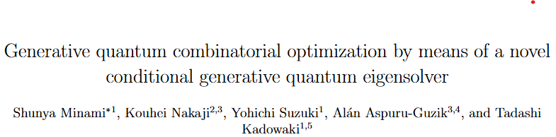
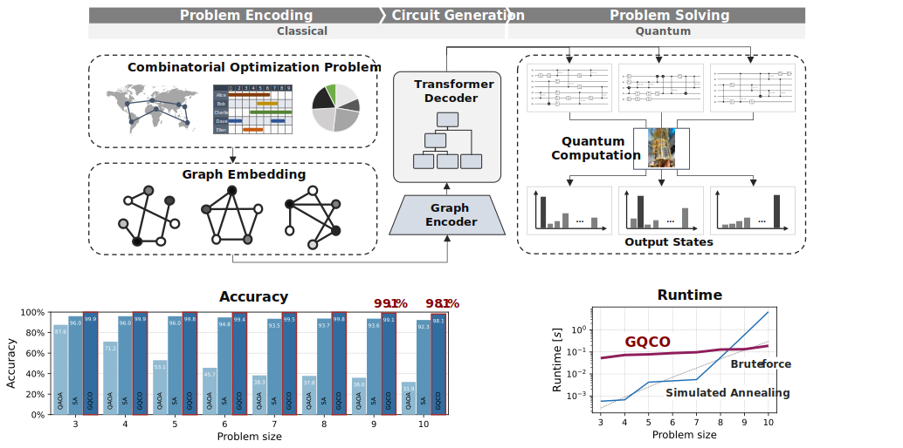

<!-- markdownlint-disable first-line-h1 -->
<!-- markdownlint-disable html -->
<!-- markdownlint-disable no-duplicate-header -->

<div align="center">
  
</div>
<hr>

<p align="center">
  <a href="XXX"><b>Model Download</b></a> |
  <!-- <a href="https://arxiv.org/abs/2501.16986"><b>Paper Link</b></a> | -->
  <a href="https://arxiv.org/abs/2501.16986"><b>Arxiv Paper Link</b></a> |
  <a href=""><b>Demo</b></a>
</p>


## 1. Introduction

This repository contains the implementation of Generative Quantum Combinatorial Optimization (GQCO), a novel hybrid quantum-classical method based on the Conditional Generative Quantum Eigensolver (Conditional-GQE). 
This approach leverages encoder-decoder Transformer models to generate context-aware quantum circuits for solving combinatorial optimization problems.

As quantum computing moves towards the fault-tolerant era, hybrid algorithms that efficiently utilize both quantum and classical computation are critical. 
Traditional variational quantum algorithms (VQAs), such as Quantum Approximate Optimization Algorithm (QAOA), face challenges in scalability, expressiveness, and trainability. 
To overcome these limitations, GQCO employs a generative machine learning model that constructs quantum circuits dynamically based on problem-specific contexts.

This repository provides:

- The code for training and evaluating GQCO models.
- Implementations for quantum circuit generation using graph-based encodings and Transformer architectures.
- Benchmarking against classical optimization methods such as simulated annealing (SA) and QAOA.
- Scripts to execute our trained model on quantum simulators and real quantum devices.
- Scripts to fine-tune our trained model for users specific target.

For more details, please refer to the full paper: [Generative quantum combinatorial optimization by means of a novel conditional generative quantum eigensolver](https://arxiv.org/abs/2501.16986).


<div align="center">
  
</div>


## 2. Model Download

You can download our trained model at: [Zenodo](https://).


## 3. Quick start

### 3.1 Installation

#### Requirement
- Python 3.11
- PyTorch==2.1.0
- torch_geometric>=2.5.3
- qiskit==1.2.0
- cuda-quantum>=0.8.1
- CUDA 11.8


#### Python environment
Run `setup.sh`.
```
chmod 755 ./setup.sh

## For GPU environment
./setup.sh gpu

## For CPU environment
./setup.sh cpu
```

#### (Alternative) Step-by-step installation
If you want to setup your environment step-by-step:

1. Create and activate python environment
```
python3.11 -m venv .env
source .env/bin/activate
```

2. Installation of requirement packages
```
pip install --upgrade pip setuptools
pip install -r requirements.txt

## For JupyterLab
pip install ipykernel
python -m ipykernel install --user --name .env --display-name "Python (.env)"
```


### 3.2 Download the model
1. Download our trained model from: [Zenodo](https://).
2. Place the downloaded model at: `./model`


### 3.2 Demo for circuot generation
See: [Notebook](./notebook/Demo.ipynb)


### 3.3 Instruction for fine-tuning
Our model demonstrates high performance for problems up to 10 qubits. 
However, if you want to fine-tune the model for a specific target domain and further improve its performance, you’ll need to modify one or two functions in `./gqco/data.py`.


- You should edit the function `generate_adj()` to generate coefficient matrices for your target domain.
The following is the modification for ganerating a Hamiltonian coefficient for max-cut problem
```diff
def generate_adj(size, seed=0, device='cpu'):

    fix_seed(seed)
    
    ## generate coefficient matrix
    adj = torch.zeros((size, size), device=device)
-   for i in range(size):
-       for j in range(i, size):
-           adj[i,j] = torch.rand(1, device=device)*2-1   ## in [-1, 1]
+   for i in range(size-1):
+       for j in range(i+1, size):
+           adj[i,j] = torch.rand(1, device=device)   ## in [0, 1]
    adj = adj / torch.max(torch.abs(adj))

    return adj
```


### 3.4 Reproduce the results in the paper
See: [Notebooks](./work)


## 4. Run training code
### 4.1 First try
`kick.sh` takes two arguments; `JOB_ID` and `num_hosts`.
    
 - `JOB_ID` : ID for your job
 - `num_hosts` : Number of computing devices for distributed training

For 1-CPU environment, run the following code:
```
./kick.sh 0 1
```
You may be asked to log in to wandb. You can change the corresponding option in `option.sh` if you don't like that.

The log and checkpoints will be saved in `./outputs/<JOB_ID>`

### Distributed training with ABCI2.0
Use `kick_ABCI.sh`.

Note that you should set the absolute path to this directory in your environment using `cd <your directory>` (line 10).

The user guide for ABCI is [here](https://docs.abci.ai/v3/en/).


## 5. Contributors
- Shunya Minami (AIST)


## 6. Related projects
Coming soon.


## 7. Acknowledgements
This work was performed for Council for Science, Technology and Innovation (CSTI), Cross-ministerial Strategic Innovation Promotion Program (SIP), “Promoting the application of advanced quantum technology platforms to social issues” (Funding agency : QST). This work was supported by JSPS KAKENHI Grant-in-Aid for Research Activity Start-up (23K19980). Classical computational resources were provided by AI Bridging Cloud Infrastructure (ABCI) of National Institute of Advanced Industrial Science and Technology (AIST). Quantum computational resources were provided by Amazon Braket. SM, YS, and TK would like to express the gratitude to Yusuke Hama and Shiro Kawabata for their insightful discussions and supports. AAG thanks Anders G. Frøseth for his generous support and acknowledges the generous support of Natural Resources Canada and the Canada 150 Research Chairs program.


## 8. Copyright and licence
This code repository is licensed under MIT License.


## 9. Citaion
```
@misc{minami2025generative,
      title={Generative quantum combinatorial optimization by means of a novel conditional generative quantum eigensolver},
      author={Minami, Shunya and Nakaji, Kouhei and Suzuki, Yohichi and Aspuru-Guzik, Al\'{a}n and Kadowaki, Tadashi},
      year={2025},
      eprint={2501.16986},
      archivePrefix={arXiv},
      primaryClass={quant-ph},
      url={https://arxiv.org/abs/2501.16986},
}
```

## 10. Contact
If you have any questions, please contact us.

